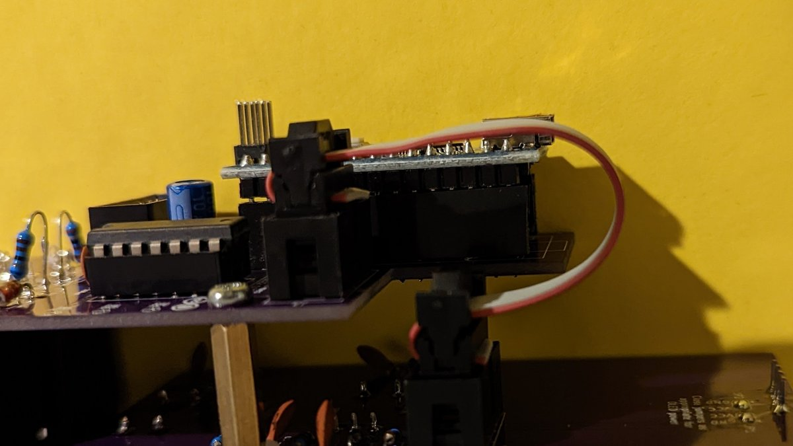
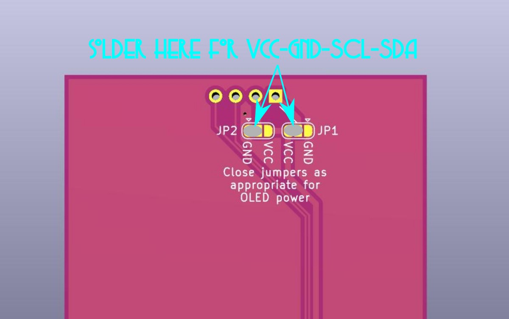
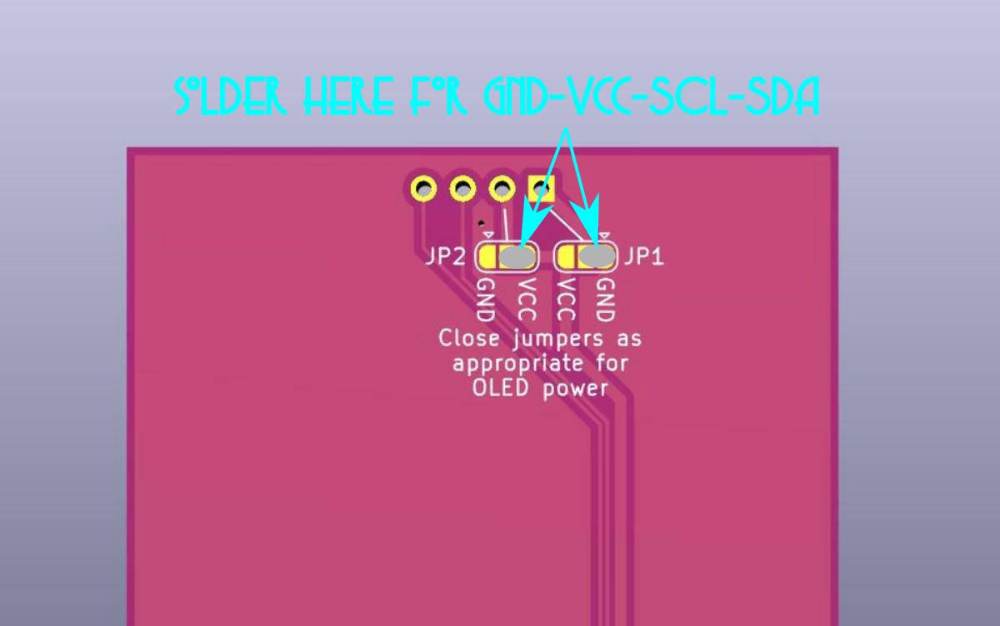
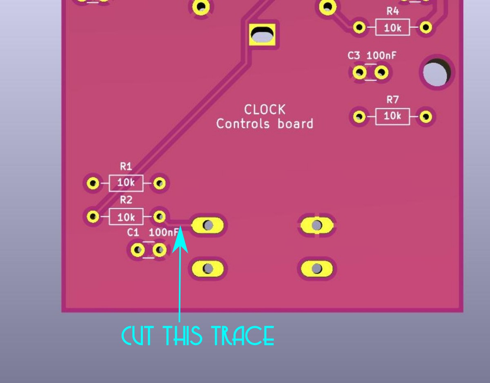
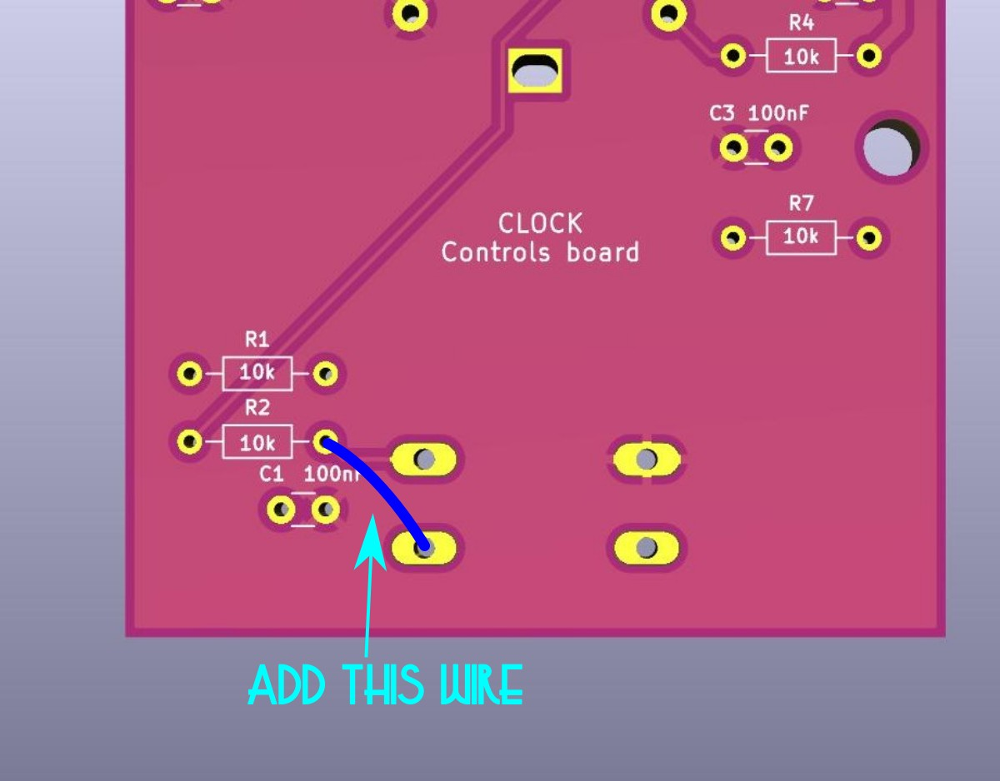

# Clock build notes

Footprints for resistors are small ones — you can use 1/8 watt resistors, or you can use regular 1/4 watt resistors stood on end at least on the back board — check vertical clearance on the front board.

For socketing the Nano I use two 15-position 2.54 mm pitch pin sockets.

The front board is held in place to the panel with the encoder. I used two 15 mm M3 spacers each with two nylon M3 washers to connect the two PCBs. (Note one of the mounting holes is under the Nano.)

Make a short 8-conductor ribbon cable to go from one PCB to the other. Take your time to pay attention to the red stripe and the directions of the connectors!

Different versions of the OLED module have different pinouts: Some go GND-VCC-SCL-SCA, others go VCC-GND-SCL-SCA. Put a blob of solder on each of the two solder jumpers depending on which kind of OLED you have.

## Errata

Some problems with the first run boards:

* The mounting holes on the panel for the OLED are slightly too small for M3 hardware. Use M2.5 or enlarge the holes.
* These mounting holes are of limited use anyway. Once the OLED is soldered to the front board, it will be nearly impossible to add or remove nuts to secure the screen. I used 6 mm screws and nuts to provide alignment for the OLED (and to avoid empty holes on the panel).
* The push button is connected wrong. To correct this:
    1. Using a hobby knife, cut across the trace that runs from the upper left switch pad (as viewed from the back of the board) to the right R2 pad. Verify there is no longer connectivity between these pads.
    2. Add a small wire from the right R2 pad to the lower left switch pad.

